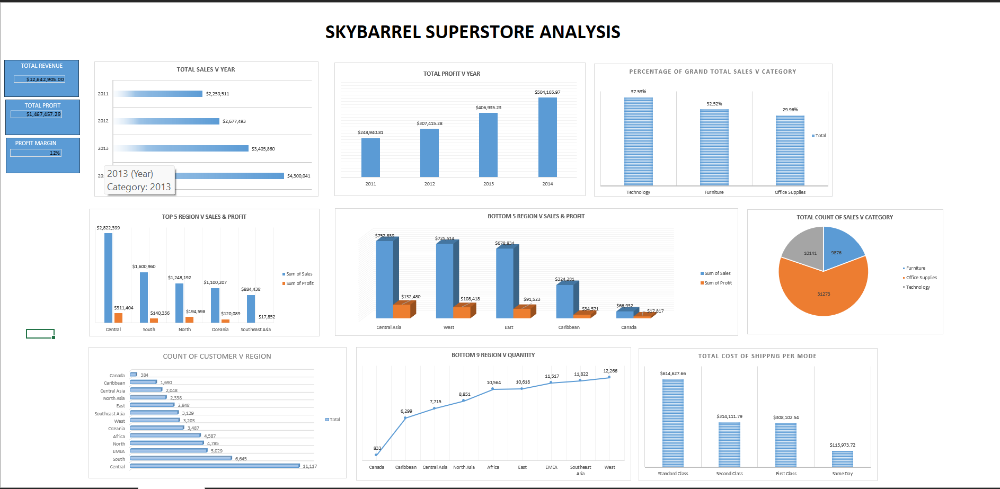
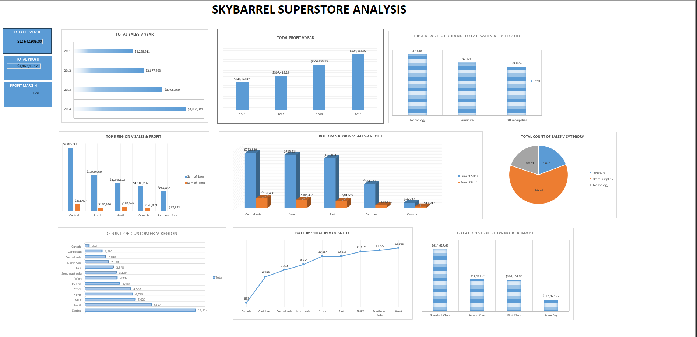

## Excel Superstore Sales Dashboard

This project analyzes retail sales data using Microsoft Excel. The goal was to transform raw transactional data from the Skybarrel Superstore dataset into meaningful business insights through pivot table analysis and an interactive dashboard.

## Tools Used
- Microsoft Excel
- Pivot Tables
- Data Visualization
- Excel Functions

## Project Tasks
- Cleaned and prepared the dataset for analysis
- Created calculated fields such as Total Profit, Quantity, and Discounts
- Built pivot tables to analyze sales performance
- Designed an interactive dashboard summarizing key metrics

## Dashboard Insights
The dashboard highlights:

- Total revenue and profit performance
- Sales trends by year
- Product category contribution
- Top and bottom performing regions
- Customer distribution by region
- Shipping cost analysis

## Files
- Superstore-Sales-Dashboard-Analysis.xlsx
- Dashboard-Preview.png
- Pivot-Analysis.png
[6:33 PM, 3/11/2026] .: ## Dashboard Preview

## Pivot Table Analysis

